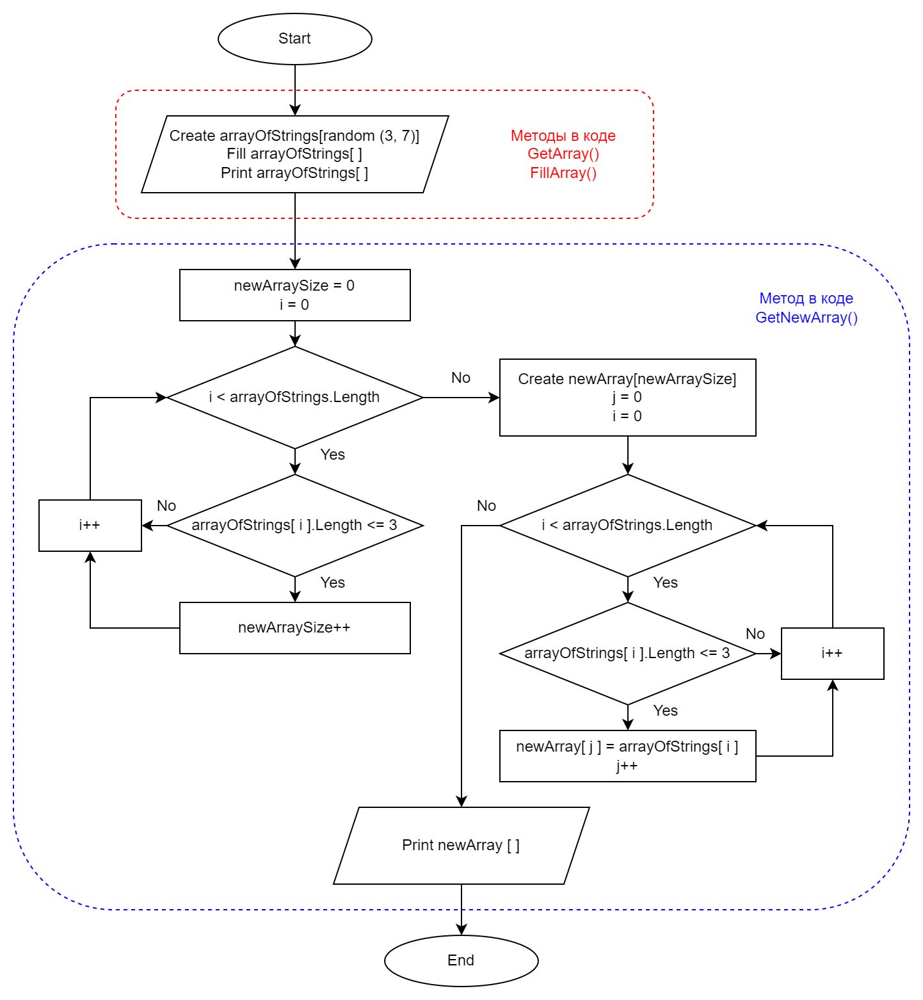

# **Задача**

Написать программу, котрая из имеющегося массива строк формирует массив из строк, длинна которых меньше или равна 3 символам. Первоначальный массив можно ввести с клавиатуры, либо задать при старте выполнения алгоритма. При решении не рекомендуется пользоваться коллекциями, лучше обойтись исключительно массивами.

# **Алгоритм**

1. Задать рандомный массив от 3 до 6 элементов.  
2. Заполнить массив с клавиатуры.
3. Вывести заполненный первоначальный массив.
4. Определить размер нового массива.  
5. Создать и заполнить новый массив по условию.
6. Вывести новый массив.

# **Блок-Схема**

